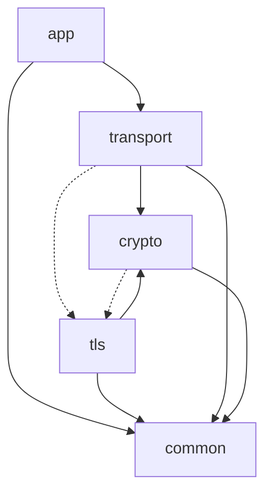

# 各階層の解説

この章は、5層をそれぞれが解く問題から説明する。
各層について、何を引き受けるのか、なぜ独立した層なのか、下位に何を頼り上位に何を提供するのか、設計上どこが勘所かを順に述べる。

層間の依存は、おおむね上から下への一方向に流れる。
唯一の例外が QUIC と TLS の統合点で、ここだけは transport と crypto が tls を逆向きに参照する。

## common：全層が共有する最下層

common は、ほかのすべての層が踏む土台を提供する。
QUIC のワイヤ表現は可変長整数（varint）で始まる。
パケット番号、フレーム種別、ストリーム ID、各種の長さは、いずれも値の大きさに応じて1から8バイトへ伸縮する varint で符号化される（RFC 9000 §16）。
この符号化を各層が別々に持つと、わずかな実装差が相互運用の破綻になる。
そこで varint とバイトカーソル（読み書き位置を持つバイト列の走査子）を common に一本化し、全層が同じ実装を共有する。

下位には何も依存しない。
syscall ラッパと乱数（`getrandom`）、エラーコードもここに置く。

設計の勘所は、単一翻訳単位ビルドでの記号衝突を避けることにある。
このプロジェクトのテストは、全ソースを1つの翻訳単位へまとめてコンパイルする。
そのため、別々のドメインが同じ名前の `static` 補助関数を定義すると衝突する。
バイトのコピーやビッグエンディアンの読み書きといった小関数は、各所で `static` を再発明せず、common に `inline` として置いて共有する。

代表的なドメインは、varint、バイトカーソル、syscall、乱数である。

## crypto：パケットを守り、相手を証明する

crypto は、暗号という1つの関心ごとを引き受ける。
QUIC は Initial を含む全パケットを暗号化するため、AEAD によるパケット保護は接続のあらゆる場面で要る。
証明書の検証には署名検証が、鍵スケジュールには鍵導出が要る。

この層が独立している理由は、暗号関数が QUIC を知らない純粋な関数だからである。
AES-GCM も ChaCha20-Poly1305 も X25519 も、入力から出力への決定的な写像であり、QUIC の状態にも TLS のメッセージにも依存しない。
依存しないからこそ、公式テストベクタを与えれば単独で正しさを検証できる。
QUIC の文脈から切り離せる関心を切り離すのが、この層の設計判断である。

下位には common だけを頼る。
上位の transport にはパケット保護のための AEAD を、tls には鍵スケジュールのための HKDF を提供する。

勘所は、tls との接点が `HKDF-Expand-Label` にあることである。
TLS 1.3 の鍵スケジュールはラベル付きの HKDF 展開で鍵を導出し、QUIC のパケット保護鍵も同じ関数から派生する。
この1点で、純粋な暗号関数の層が TLS の鍵導出と噛み合う。
crypto の一部（鍵導出と鍵集合）が tls の Initial 鍵の型を共有するのも、この接点ゆえである。

代表的なドメインは、AEAD（AES-GCM と ChaCha20-Poly1305）、ハッシュ（SHA-256 / SHA-512、HMAC）、署名（Ed25519、ECDSA P-256、RSA-PSS）、鍵導出（HKDF）、X.509 の解析と検証である。

## transport：UDP の上に信頼できる多重化ストリームを敷く

transport は、UDP が持たないものをすべて足して、信頼できる多重化されたストリームを提供する。
ここで、なぜ TCP ではなく UDP の上に作るのかという問いに答えておく。
TCP は平文のヘッダを経路上の中間装置に晒し、その装置が値を前提に振る舞うことで、プロトコルの進化が縛られてきた。
QUIC はパケットを暗号化して中間装置の関与を排し、ヘッダブロッキングを避けるために1接続内で複数ストリームを多重化し、輻輳制御をアプリケーション側へ移してカーネルの更新から独立させる。
これらの利点は、信頼性や順序を持たない UDP を土台に選んで初めて手に入る。

その代償として、UDP は失われたパケットを再送しない。
そこで損失検知、輻輳制御、ACK の生成と処理を、この層が自前で持つ。
下位には crypto（パケット保護）と common を頼り、統合点でだけ tls を逆向きに参照する。
上位の app には、ストリーム単位の信頼できるバイト列を提供する。
io がカーネルとの境界で、IPv4 と UDP のヘッダを整形し、ソケットを操作する。

勘所は二重のフロー制御である。
QUIC は接続全体の受信量と、各ストリームの受信量を別々に制限する。
片方だけでは、1本のストリームが接続全体の受信バッファを食い潰す事態を防げない。
接続単位とストリーム単位の2つの上限を同時に管理することが、この層の中心的な難しさになる。
輻輳制御は NewReno を用い、初期ウィンドウは最大データグラムサイズの10倍（おおよそ 10 × 1200 バイト）から始める。

代表的なドメインは、パケット整形と保護、フレームの符号化、損失回復と輻輳制御、ストリームと二重フロー制御、接続のライフサイクル、UDP 入出力である。

## tls：鍵を作り、相手を認証する

tls は、暗号化のための鍵を作る役と、相手が本物かを確かめる役の2つを担う。
ハンドシェイクは ECDHE 鍵交換で共有秘密を作り、その秘密から QUIC のパケット保護鍵を導く。
同時に、サーバの証明書とその署名を検証して、通信相手を認証する。
鍵を作れなければ暗号化できず、相手を認証できなければ暗号化しても意味がないため、この2役は分けられない。

下位には crypto（署名検証、鍵導出、ハッシュ）と common を頼る。
上位の transport には、各暗号化レベルの保護鍵を提供する。

最重要の勘所は QUIC と TLS の統合である。
TLS 1.3 は本来 TCP の上で動き、自前のレコード層でメッセージを運ぶ。
QUIC ではこのレコード層を使わず、TLS のハンドシェイクメッセージを QUIC の CRYPTO フレームに載せて運ぶ。
そのため tls は、メッセージを組み立てて transport の CRYPTO ストリームへ渡し、受け取ったバイト列を再びハンドシェイクメッセージへ組み直す必要がある。
この統合のために、層の依存が一方向に収まらない。

もう1つの勘所はトランスポートパラメータである。
QUIC の接続設定（フロー制御の初期上限、最大アイドル時間、接続 ID の扱いなど）は、TLS の拡張に詰めてハンドシェイクと一緒に運ばれる。
鍵交換のための仕組みである TLS 拡張が、QUIC の設定値の伝達路を兼ねる。

代表的なドメインは、ClientHello と ServerHello の構築と解析、鍵スケジュール、証明書と CertificateVerify の検証、鍵更新、トランスポートパラメータ拡張である。

## app：QUIC の上で HTTP を話す

app は、QUIC が提供するストリームの上で HTTP を話す。
HTTP/3 はリクエストとレスポンスをフレームに分け、それぞれを QUIC のストリームへ写す。

ここで、なぜ HTTP/2 の HPACK ではなく QPACK でヘッダを圧縮するのかに答えておく。
HPACK は、ヘッダの圧縮状態を全ストリームで共有する1本の動的表に依存し、その表を順序どおりに更新することを前提とする。
ところが QUIC のストリームは互いに独立して到達し、あるストリームのヘッダが別のストリームより先に届くことがある。
順序を前提とする HPACK をそのまま QUIC に載せると、表の更新待ちでヘッダブロッキングが再発してしまう。
QPACK は、表を更新するエンコーダ命令と、その適用を知らせるデコーダ命令を専用のストリームへ分離し、各ヘッダブロックが必要とする表の状態を Required Insert Count で指定する。
受信側は表がその状態に達するまで待てばよく、待ちは表が遅れたヘッダブロックだけに局所化される。

下位には transport（ストリーム）と common を頼る。
上位はアプリケーションそのものである。

もう1つのドメインが DATAGRAM である。
DATAGRAM フレーム（種別 0x30 / 0x31）は、QUIC の信頼性とストリーム順序をあえて捨て、低遅延を取る経路を提供する。
再送を待たない用途では、確実に届くことより速く届くことが価値になる。

代表的なドメインは、HTTP/3 のフレームと制御ストリーム、リクエストとレスポンスの組み立て、QPACK のエンコードとデコード、DATAGRAM である。
