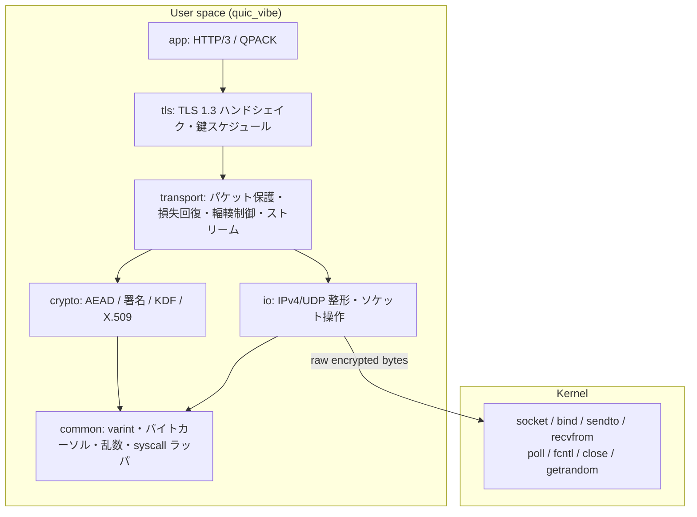
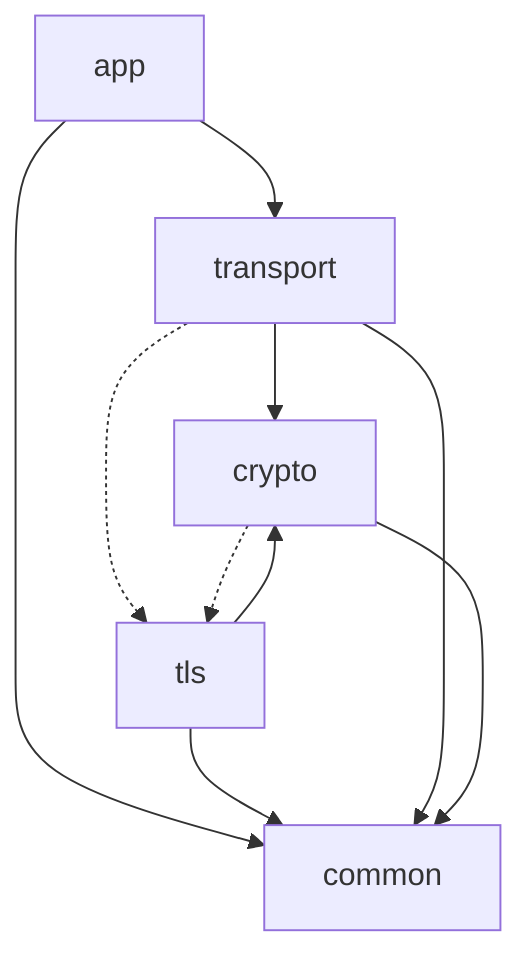
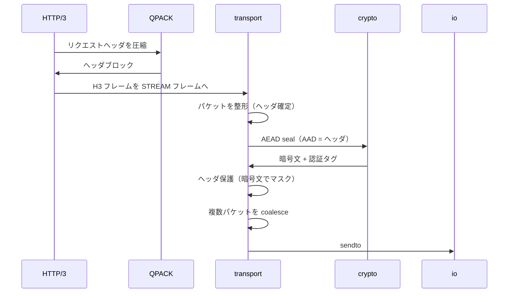
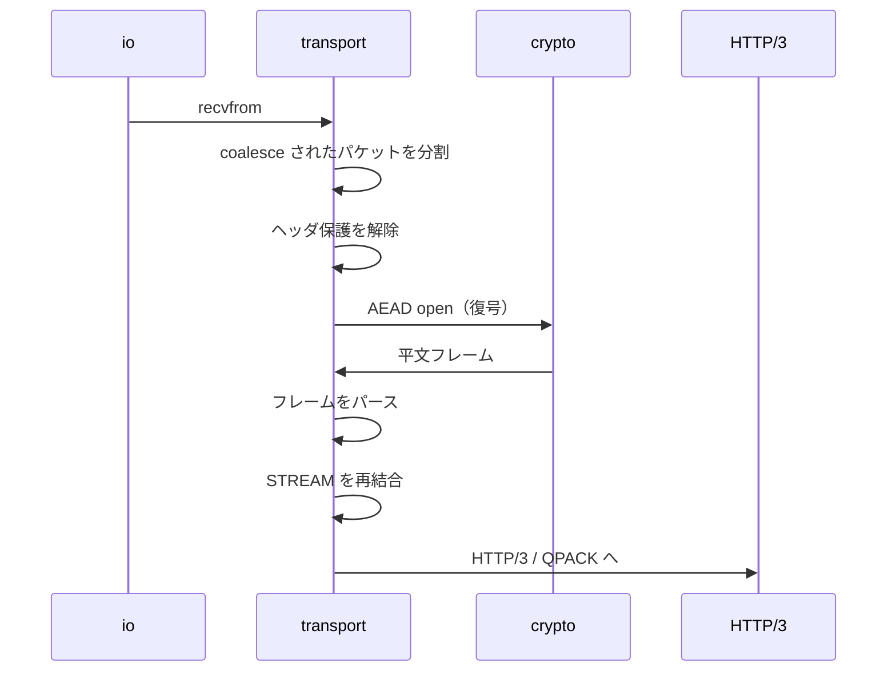
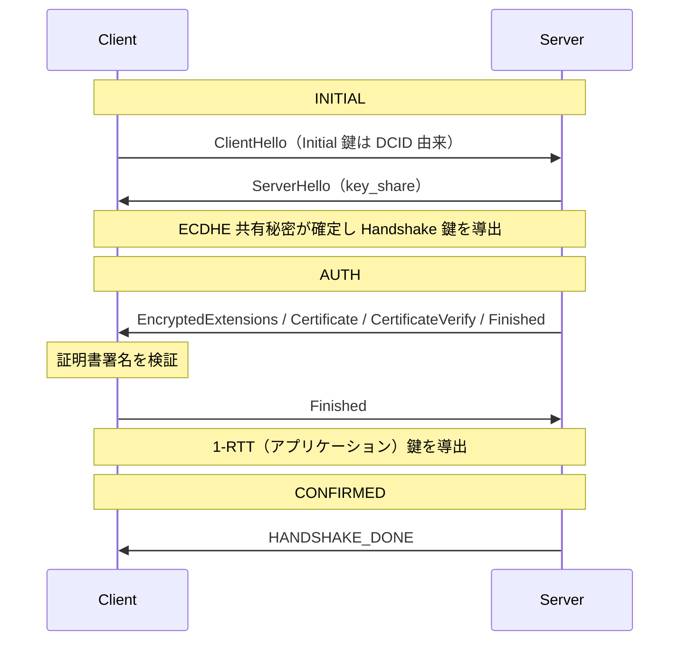

# 全体構成とデータフロー

この章は、quic_vibe がどこまでをユーザー空間で行い、カーネルに何を残すかを中心に据える。
QUIC を初めて読む人が、各層がなぜその順序で並ぶのか、なぜそこに置かれるのかを掴めることを目指す。

## ユーザー空間とカーネルの境界

TCP では、再送、順序付け、輻輳制御、接続状態のすべてをカーネルが持つ。
アプリケーションはバイトストリームの両端を触るだけで、輻輳制御の改良も新しい損失回復も、カーネルの更新を待たなければ届かない。
QUIC は UDP の上に立つことでこの拘束を外した。
UDP はデータグラムを運ぶだけで、信頼性も順序も暗号化も持たないから、それらをすべてアプリケーション側に引き取れる。
quic_vibe はこの引き取りを限界まで進め、QUIC の意味論を一切カーネルに見せない。

カーネルに残るのは、暗号化済みバイト列の運搬だけである。
syscall を実際に発行する箇所は `syscall6` というインラインアセンブリ関数1つに集約され、ほかのすべてのコードはこの関数を通してしかカーネルに触れない。
頼る syscall は、生の UDP 送受信（`sendto` / `recvfrom`）、ソケットの用意と待ち受け（`socket` / `bind` / `poll` / `fcntl` / `close`）、乱数（`getrandom`）に限られる。
カーネルが運ぶのは暗号化されたバイト列であり、その中身が QUIC のどのパケットでどのフレームかをカーネルは解釈しない。

パケットの整形、暗号化とヘッダ保護、TLS ハンドシェイク、損失回復、輻輳制御、ストリームの多重化、HTTP/3 と QPACK、X.509 の検証、すべての暗号関数は、ユーザー空間で自前に持つ。
インメモリでバイト列を往復させるだけのテスト経路（後述の memlink）に至っては、syscall すら一度も発行しない。

libc を持たない構成は、移植性と検証可能性の両方に効く。
標準ライブラリのどの実装にも依存しないため、`-ffreestanding -nostdlib` でコンパイルできること自体が、外部依存の不在を証明する。
依存が syscall ラッパ1関数に閉じているので、どこでカーネルに触れるかが一望でき、それ以外の全コードを純粋な変換として扱える。

## 5層構成

ユーザー空間のコードは5つの層に分かれる。
上の層ほど抽象度が高く、下の層ほど土台に近い。

| 層 | ディレクトリ | 責務 |
|----|------------|------|
| app | `src/app/` | HTTP/3 のフレームと状態機械、QPACK によるヘッダ圧縮。 |
| tls | `src/tls/` | TLS 1.3 ハンドシェイク、鍵スケジュール、トランスポートパラメータ。 |
| transport | `src/transport/` | パケット整形と保護、損失回復、輻輳制御、ストリーム、UDP 入出力。 |
| crypto | `src/crypto/` | AEAD、ハッシュ、署名、鍵導出、X.509 の解析と検証。 |
| common | `src/common/` | varint、バイトカーソル、syscall ラッパ、乱数、エラーコード。 |

依存はおおむね上から下へ一方向に流れる。
ただし QUIC と TLS の統合点では、この一方向が崩れる。

点線が、層境界と鍵境界が一致しない例外を表す。
QUIC のハンドシェイクは、TLS のメッセージを CRYPTO フレームに載せて QUIC のパケットで運ぶ。
そのため transport は TLS のハンドシェイクを駆動するために tls を参照し、crypto の鍵導出は最初の Initial 鍵の型を tls と共有する。
鍵を作るのは tls だが、その鍵で守るバイト列を運ぶのは transport であり、両者は互いを必要とする。
依存を完全な下向きに揃えようとすると、この統合を不自然に切り分けることになる。
ここでは設計の事実として相互参照を残す。

common はどの層にも依存しない、完全な最下層である。
全層が同じ varint 符号化とバイトカーソルを共有し、後述する単一翻訳単位ビルドでの記号衝突を避けるため、共通の小関数はここに `inline` として置く。

## データフロー

3つの代表的な流れを追う。
いずれも、順序がなぜそうでなければならないかに注目する。

### 送信：GET から wire まで

アプリケーションが GET を発行してから、暗号化済みバイト列がソケットに渡るまでの流れを示す。

順序を崩せないのは、保護の2段が互いの出力に依存するからである。
AEAD はパケットヘッダを追加認証データ（AAD）として暗号化するため、ヘッダが確定してからでないと seal できない。
ヘッダ保護は AEAD が生んだ暗号文の一部をサンプルとしてマスクを作り、パケット番号などのヘッダ部分を覆う。
したがって、ヘッダ確定 → AEAD → ヘッダ保護の順は入れ替えられない。

### 受信：wire からアプリケーションまで

受信は送信の逆順を辿る。

ここでもヘッダ保護を先に剥がす理由がある。
ヘッダ保護はパケット番号を覆っているため、これを解除しなければパケット番号が読めない。
パケット番号は AEAD のノンスを組み立てる材料であり、ノンスが定まらなければ復号できない。
つまり、ヘッダ保護の解除 → パケット番号の確定 → AEAD 復号という依存が、受信側の順序を決める。

### ハンドシェイク：鍵を作りながら接続を確立する

ハンドシェイクは、暗号化に使う鍵そのものを作り出す過程である。

最初のパケットは、まだ鍵交換が済んでいないのに暗号化しなければならない。
QUIC はこれを、接続先の宛先接続 ID（DCID）から決まった手順で Initial 鍵を導出することで解く。
Initial 鍵は秘密ではなく、経路上の誰でも同じ手順で導けるが、最初のパケットを構造化し改竄を検出する役には立つ。
ServerHello で双方の key_share が揃うと ECDHE 共有秘密が確定し、ここで初めて秘密の Handshake 鍵を導出できる。
サーバの証明書と署名を検証して相手を認証し、Finished を交換すると、アプリケーションデータ用の 1-RTT 鍵が導出される。
最後に HANDSHAKE_DONE を受け取ると接続は CONFIRMED に移り、Handshake 鍵は破棄される。
INITIAL から AUTH を経て CONFIRMED へ至るこの流れは、鍵が無ければ暗号化できないという制約を、ハンドシェイク自身が鍵を生み出すことで解消する過程として読める。
